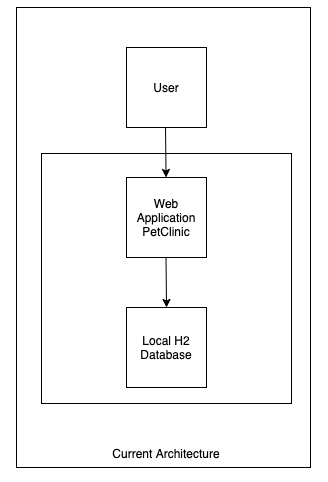
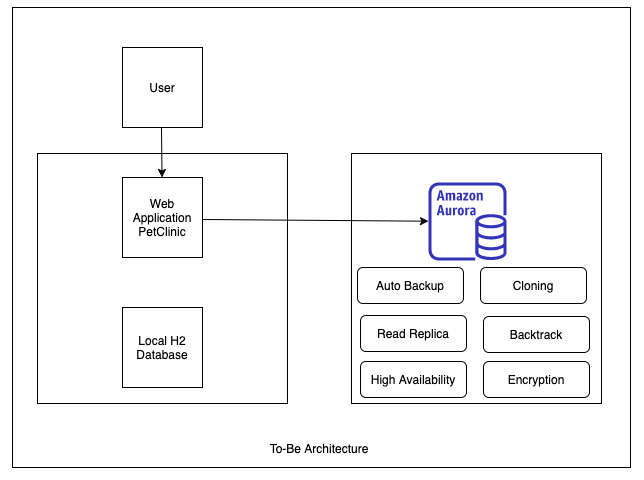

# 금일 진행 할 LAB을 소개 합니다.

**LAB 소개 전에 CloudFormation Stack 생성에 시간이 걸리기 때문에 먼저 LAB01로 이동하여 Step 1 ~ 4를 먼저 진행하겠습니다.**

> > 클릭하여 LAB01로 이동해주세요.[AuroraLab01.md](AuroraLab01.md)

---

1. 오늘 LAB에서는 Spring Boot의 PetClinic Web Application을 사용합니다. PetClinic은 Java Application과 내장 H2 Database를 사용하게 됩니다.

<kbd>  </kbd>

<kbd>  </kbd>

<kbd>  </kbd>
