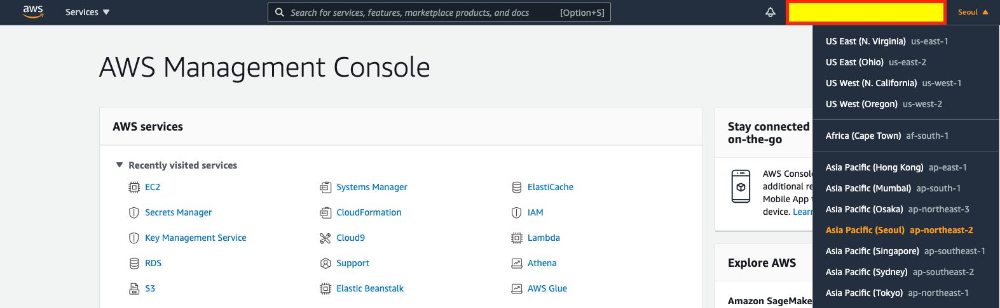

# LAB 환경 구성

1. AWS Console Login - 자신의 AWS IAM 계정으로 Login 합니다.
   `https://console.aws.amazon.com/`

<kbd>  </kbd>

2. Region에서 Seoul(ap-northeast02)을 선택

<kbd>  </kbd>

3. 다음의 주소를 복사해서 Browser의 새 창에 Copy and Paste합니다. CloudFormation Template을 사용하여, 실습 환경을 만들게 됩니다.

`https://console.aws.amazon.com/cloudformation/home?region=ap-northeast-2#/stacks/create/review?stackName=auroralab&templateURL=https://shared-kiwony.s3.ap-northeast-2.amazonaws.com/lab_template.yml&param_deployCluster=Yes`

4. "I acknowledge that AWS CloudFormation might create IAM resources with custom names"를 Check 하고 "Create Stack" Click

<kbd>  </kbd>

5. CloudFormation의 "Event" Tab에서 진행 상황을 확인 할 수 있습니다.

6. Stack 생성까지 10분정도가 걸립니다.

7. 아래 화면처럼 Stack Resource가 "CREATE_COMPLETE"가 되면 환경 구성이 완료된 것입니다.

<kbd>  </kbd>

8.  Stack 생성이 완료되면 Outputs Tab을 Click하고, KEY와 Value를 별도의 엑셀에 복사해둡니다. (이후 Step에서 사용됨)

<kbd>  </kbd>

9. ec2Instance 항목에 `i-0123456789abcdef0` 형태의 Instance ID가 존재하는지 확인하세요.

10. Stack 생성을 기다리면서 RDS Aurora를 수동으로 만드는 방법을 살펴보겠습니다.

11. 수고하셨습니다. 다음 챕터로 이동하세요. [AuroraLab02.md](AuroraLab02.md)
