# Aurora의 다양한 기능을 살펴 봅니다.

## Backup & Recovery

**Aurora MySQL은 5분 주기 자동 Backup 기능을 제공 합니다.**

**실습에서는 Manual Backup과 복구를 해보도록 하겠습니다.**

**Manual Backup의 경우 별도로 삭제 하지 않을 경우 Data가 영구 저장 되기 때문에, Compliance 목적으로 사용 가능합니다.**

**Manual Backup을 이용하여 개발, 테스트 시스템을 구성 가능하며 Migration 용도도 가능합니다.**

1. Services => RDS => Databases

2. auroralab-mysql-node-1 선택 후 Actions => Take Snapshot

   <kbd> 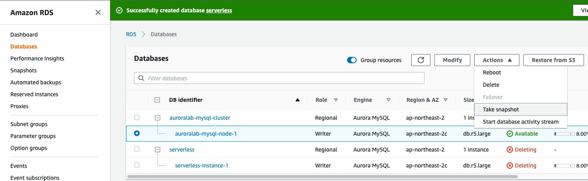 </kbd>
   <kbd>  </kbd>
   <kbd> 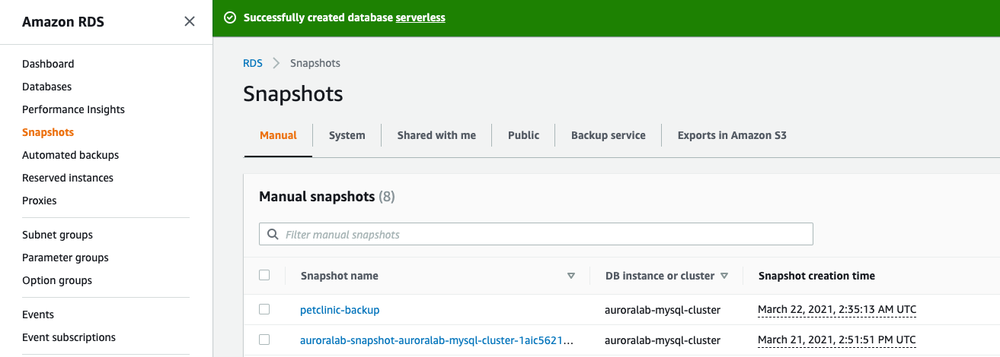 </kbd>

3. Snapshot status가 "Available" 가 되면 해당 Snapshot을 이용하여 다양한 용도로 사용 가능합니다.

   <kbd> 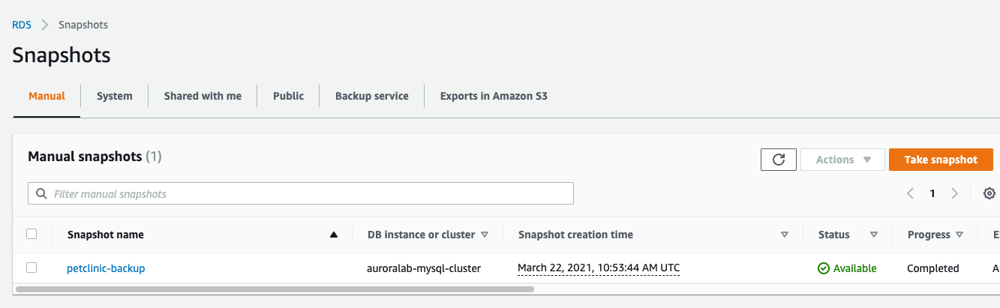 </kbd>

4. 생성된 Snapshot을 이용하여 개발팀에서 UAT용으로 요청한 DB를 생성하겠습니다. Snapshot을 선택하고 Actions => "Restore Snapshot" 선택

   <kbd> 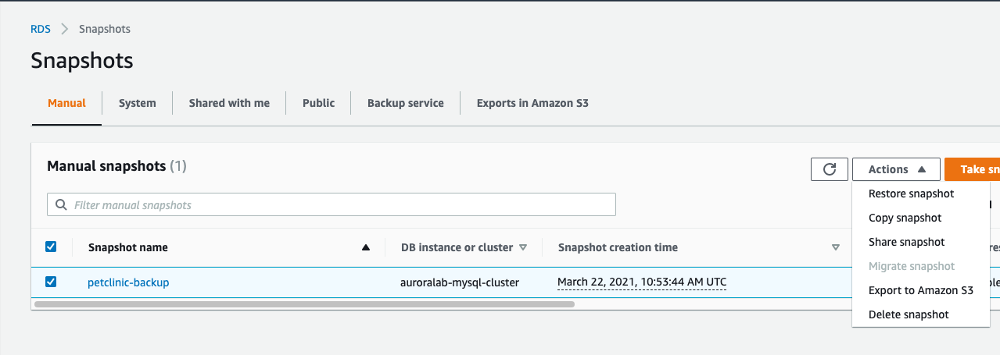 </kbd>

5. Restore Snapshot

```
   1. DB Instance identifier : UAT
   2. 나머지는 Default value 사용
   3. "Restore DB Cluster" Click
```

6. UAT Cluster와 DB가 생성되는 것을 확인 합니다. 이제 개발 팀에서 10분후에 UAT System을 이용하여 개발을 시작 할 수 있습니다.

   <kbd> 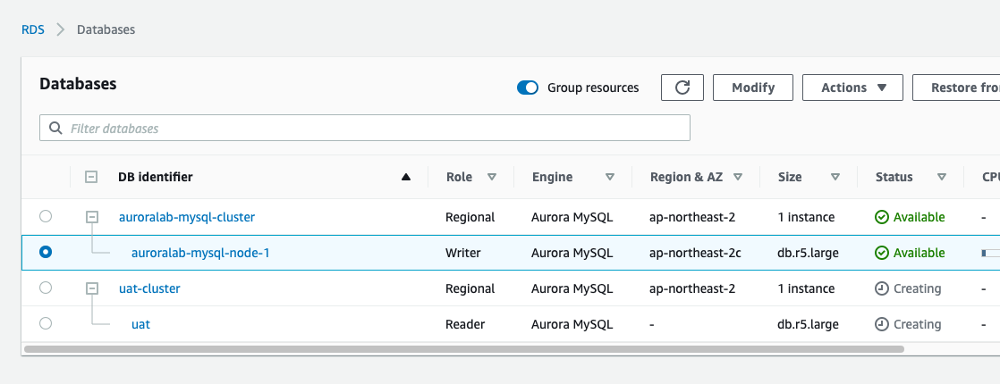 </kbd>

## Database Cloning

**Aurora Cloning 기능을 사용하게 되면 "Copy on Write" 기능을 사용하여 빠르게 Clone 디비를 생성 할 수 있습니다**

**Copy on Write의 특성으로 변경된 Data Block만 새롭게 기록하기 때문에 Storage 를 아낄 수 있습니다.**

**Finanace Application이 변경되어서 해당 Module을 Test하기 위한 clone-fin DB를 생성하겠습니다.**

1. auroralab-mysql-cluster를 선택 후 Actions => "Create Clone" Click

   <kbd>  </kbd>

2. Create Clone

```
   1. DB instance identifier : clone-fin
   2. 나머지는 Default value 사용
   3. "Create clone" click
```

3. clone-fin-cluster가 생성되는 것을 확인합니다.

   <kbd> 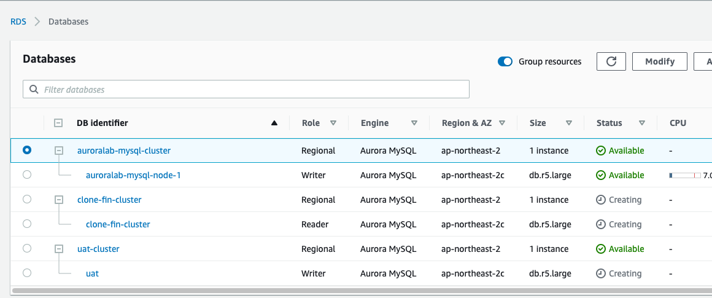 </kbd>

4. clone-fin cluster와 DB 생성을 확인합니다.

   <kbd> 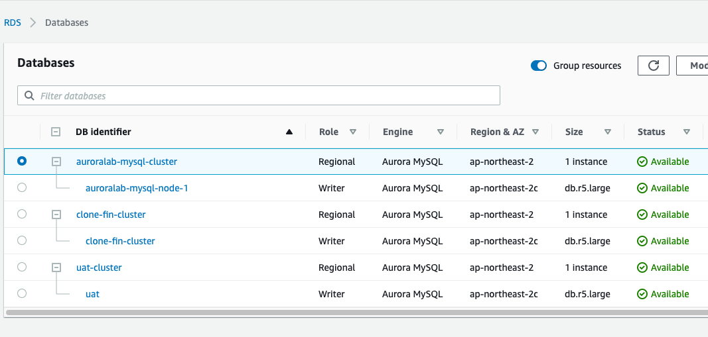 </kbd>

## Backtrack

**Backtrack 기능을 사용하면 사용자의 실수에 의한 Data 삭제나 Table Drop에 의해 유실 된 Data 복구 가능**

1.  Aurora MySQL에 접속 후 현재 Data를 확인하고 현재 시간을 확인합니다.

```
ubuntu@ip-172-31-0-183:~$  mysql -h$DBURL -u$DBUSER -p"$DBPASS"
mysql> use petclinic
mysql> select id,first_name,last_name from owners order by 1;
+----+------------+-----------+
| id | first_name | last_name |
+----+------------+-----------+
|  1 | George     | Franklin  |
|  2 | Betty      | Davis     |
|  3 | Eduardo    | Rodriquez |
|  4 | Harold     | Davis     |
|  5 | Peter      | McTavish  |
|  6 | Jean       | Coleman   |
|  7 | Jeff       | Black     |
|  8 | Maria      | Escobito  |
|  9 | David      | Schroeder |
| 10 | Carlos     | Estaban   |
| 11 | aurora     | mysql     |
| 12 | Gildong    | Hong      |
| 13 | Elsa       | Ice       |
+----+------------+-----------+
13 rows in set (0.00 sec)

mysql> select id, name, type_id from pets where owner_id in (11,12,13);
+----+-------------------+---------+
| id | name              | type_id |
+----+-------------------+---------+
| 14 | RDS-Aurora-DOG    |       2 |
| 15 | Gildong-Pet       |       5 |
| 16 | Gildong-Pet-dog01 |       2 |
| 17 | Olaf              |       6 |
+----+-------------------+---------+
4 rows in set (0.00 sec)

mysql> SELECT current_timestamp();
+---------------------+
| current_timestamp() |
+---------------------+
| 2021-03-22 14:13:37 |
+---------------------+
1 row in set (0.00 sec)

```

2. 10초 정도 후에 사용자 실수에 의해 Data가 삭제되는 상황을 만들어 보겠습니다. PETS Table의 일부 Data를 삭제 합니다.

```
mysql> SELECT 'Before', SLEEP(10), 'AFTER';
+--------+-----------+-------+
| Before | SLEEP(10) | AFTER |
+--------+-----------+-------+
| Before |         0 | AFTER |
+--------+-----------+-------+
1 row in set (10.00 sec)

mysql> delete from pets where owner_id in (11,12,13);
Query OK, 4 rows affected (0.03 sec)

mysql> commit;
Query OK, 0 rows affected (0.00 sec)

mysql>  SELECT current_timestamp();
+---------------------+
| current_timestamp() |
+---------------------+
| 2021-03-22 14:13:57 |
+---------------------+
1 row in set (0.00 sec)

mysql> exit
```

3. PetClinic Application을 기동하고 Pets항목을 조회하여 사용자 실수로 인해 Data가 유실된 것을 확인 합니다.

```
ubuntu@ip-172-31-0-183:~$ cd spring-petclinic/
ubuntu@ip-172-31-0-183:~/spring-petclinic$ java -jar target/*.jar
```

4. PetClinic Application에 접속해서 아까 입력한 PET Data들이 보ㅈ는지 확인합니다. http://EC2-Public-IP:8080. (Onwers 11,12,13의 Pets 항목이 모두 삭제 된것을 확인)

   <kbd> 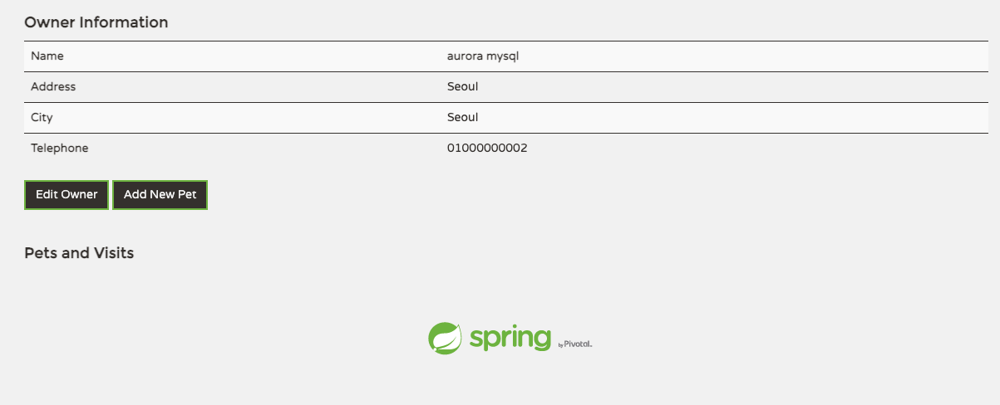 </kbd>

   <kbd>  </kbd>

   <kbd> 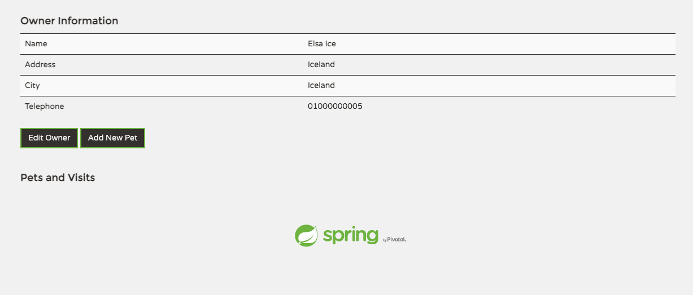 </kbd>

5. 현재 실행중인 PetClinic Application을 중지합니다. (CTRL+C)로 실행중인 Java process를 종료합니다.

6. Backtrack을 사용하여 Pets 데이터가 삭제 되기 이전 상태로 DB를 되돌립니다. Timestamp를 Delete 하기전 확인 했던 시간으로 지정합니다.

```
aws rds backtrack-db-cluster \
--db-cluster-identifier auroralab-mysql-cluster \
--backtrack-to "2021-03-22T14:13:37Z

ubuntu@ip-172-31-0-183:~/spring-petclinic$ aws rds backtrack-db-cluster \
> --db-cluster-identifier auroralab-mysql-cluster \
> --backtrack-to "2021-03-22T14:13:37Z"
{
    "DBClusterIdentifier": "auroralab-mysql-cluster",
    "BacktrackIdentifier": "a5507cbc-7815-4ba8-ac23-68faaa0fcea2",
    "BacktrackTo": "2021-03-22T14:13:37Z",
    "BacktrackRequestCreationTime": "2021-03-22T14:21:25.104Z",
    "Status": "PENDING"
}
"
```

7. Backtrack 상태를 아래의 command로 조회합니다. available 상태가 될때까지 기다립니다. (BackTrack을 위해 1-2 분 정도 소요됩니다.)

```
while true
do
aws rds describe-db-clusters \
--db-cluster-identifier auroralab-mysql-cluster \
| jq -r '.DBClusters[0].Status'
sleep 5;
done

```

```
ubuntu@ip-172-31-0-183:~/spring-petclinic$ aws rds describe-db-clusters \
> --db-cluster-identifier auroralab-mysql-cluster \
> | jq -r '.DBClusters[0].Status'
backtracking

ubuntu@ip-172-31-0-183:~/spring-petclinic$ aws rds describe-db-clusters --db-cluster-identifier auroralab-mysql-cluster | jq -r '.DBClusters[0].Status'
available
```

8. Pets Table의 실수로 삭제 된 Data가 복구 됐는지 DB에서 확인합니다.

```
ubuntu@ip-172-31-0-183:~/spring-petclinic$ mysql -h$DBURL -u$DBUSER -p"$DBPASS" petclinic -e "select id, name, type_id from pets where owner_id in (11,12,13);"
mysql: [Warning] Using a password on the command line interface can be insecure.
+----+-------------------+---------+
| id | name              | type_id |
+----+-------------------+---------+
| 14 | RDS-Aurora-DOG    |       2 |
| 15 | Gildong-Pet       |       5 |
| 16 | Gildong-Pet-dog01 |       2 |
| 17 | Olaf              |       6 |
+----+-------------------+---------+
```

9. PetClinic 접속 Pets 항목 확인 http://EC2-Public-IP:8080. (Pets 항목이 모두 복구 된것을 확인)

```
ubuntu@ip-172-31-0-183:~$ cd spring-petclinic/
ubuntu@ip-172-31-0-183:~/spring-petclinic$ java -jar target/*.jar
```

<kbd> 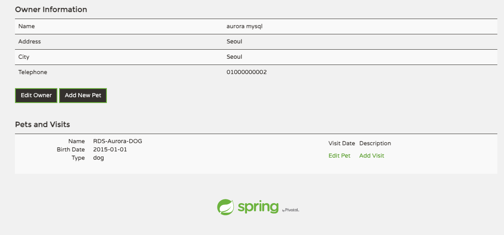 </kbd>

<kbd> 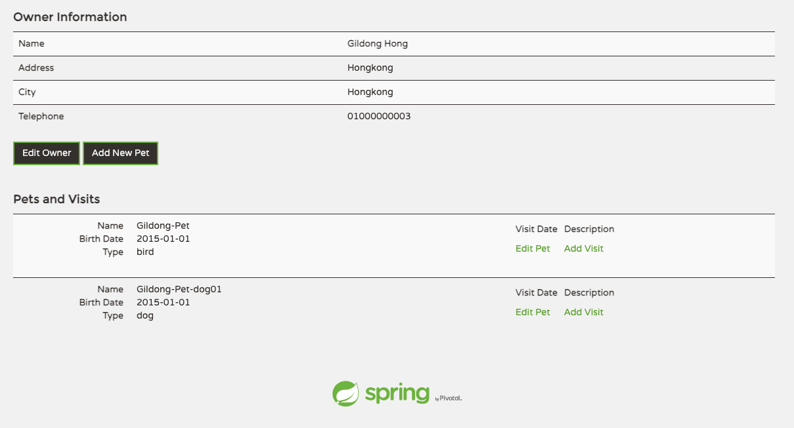 </kbd>

<kbd> 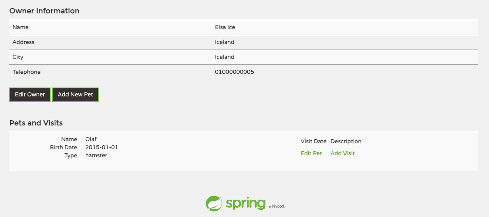 </kbd>

10. 현재 실행중인 PetClinic Application을 중지합니다. (CTRL+C)로 실행중인 Java process를 종료합니다.

11. 수고하셨습니다. 다음 챕터로 이동하세요. [AuroraLab05.md](AuroraLab05.md)
