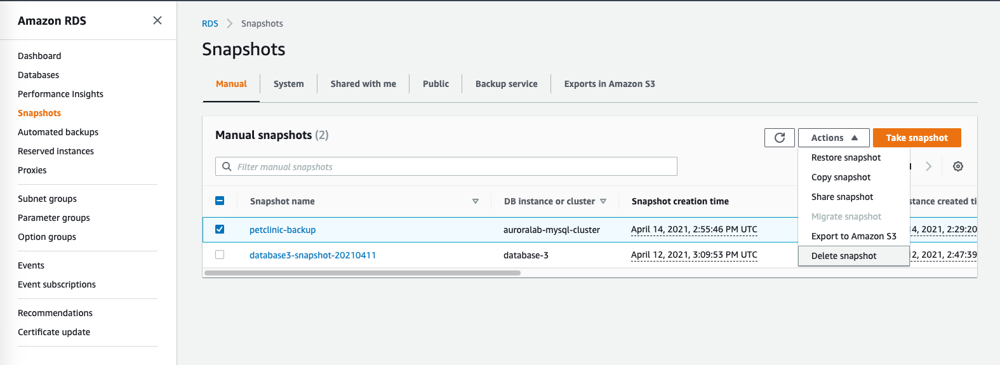
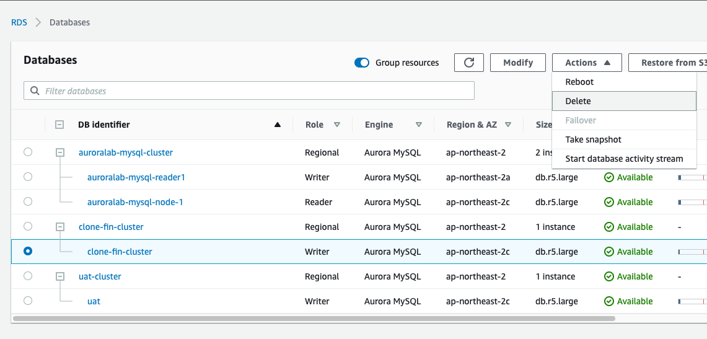
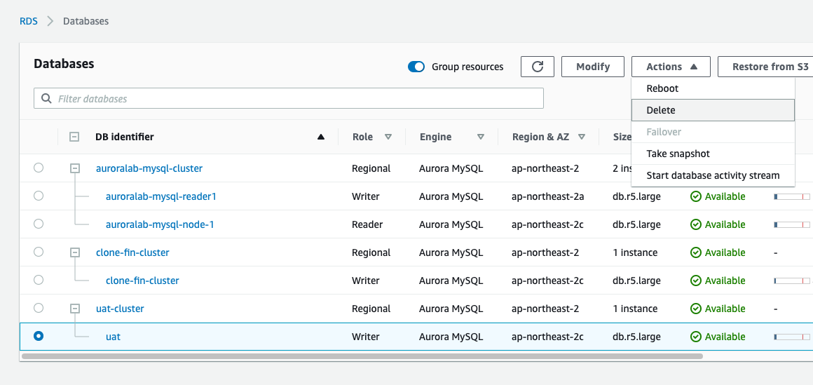
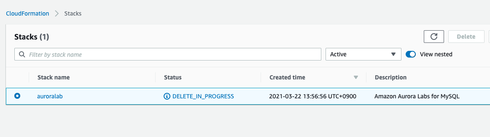

# Resouce를 삭제 합니다.

1. Services => RDS => Snapshot으로 이동합니다.

---

2. petclinic-backup을 선택 후 "Delete snapshot"을 Click합니다.

   <kbd>  </kbd>

---

3. Services => RDS => Databases, clone-finance-cluster, uat-cluster를 삭제합니다.

   <kbd>  </kbd>

   <kbd>  </kbd>

---

4. Services => CloudFormation => auroralab 선택 후 Delete

   <kbd>  </kbd>

---

5. CloudFormation에서 auroralab Stack이 사라짐을 확인합니다.
