```
ubuntu@ip-172-31-31-236:~/bike$ cat /tmp/bike.csv |wc -l
5562329

ubuntu@ip-172-31-31-236:/tmp$ ls -alh
-rw-rw-r--  1 ubuntu ubuntu 1.1G Mar 29 14:28 bike.csv
-rw-rw-r--  1 ubuntu ubuntu 209M Mar 29 14:39 bike_aa
-rw-rw-r--  1 ubuntu ubuntu 209M Mar 29 14:39 bike_ab
-rw-rw-r--  1 ubuntu ubuntu 209M Mar 29 14:39 bike_ac
-rw-rw-r--  1 ubuntu ubuntu 209M Mar 29 14:39 bike_ad
-rw-rw-r--  1 ubuntu ubuntu 202M Mar 29 14:39 bike_ae

export DBHOST=aurora572072-instance-1.cf89zyffo8dr.ap-northeast-2.rds.amazonaws.com

ubuntu@ip-172-31-31-236:~$ mysql -uadmin -p -h$DBHOST --local-infile=1

mysql> create database test;
Query OK, 1 row affected (0.00 sec)

mysql> use test;
Database changed

create table bike
(
tripduration CHAR(200),
starttime CHAR(200),
stoptime CHAR(200),
start_station_id CHAR(200),
start_station_name CHAR(200), start_station_latitude CHAR(200),
start_station_longitude CHAR(200),
end_station_id CHAR(200),
end_station_name CHAR(200),
end_station_latitude CHAR(200),
end_station_longitude CHAR(200),
bikeid CHAR(200),
userty CHAR(200),
birth_year CHAR(200),
gender CHAR(200)
);


mysql> SHOW GLOBAL VARIABLES LIKE 'local_infile';
+---------------+-------+
| Variable_name | Value |
+---------------+-------+
| local_infile  | ON    |
+---------------+-------+
1 row in set (0.00 sec)

mysql>  SHOW VARIABLES LIKE "secure_file_priv";
+------------------+-------+
| Variable_name    | Value |
+------------------+-------+
| secure_file_priv | /tmp/ |
+------------------+-------+
1 row in set (0.01 sec)

mysql> load data local infile '/tmp/2013-07.csv' into table bike fields terminated by ','  lines terminated by '\n' ;
Query OK, 843417 rows affected (21.88 sec)
Records: 843417  Deleted: 0  Skipped: 0  Warnings: 0

mysql> truncate table bike;

mysql> load data local infile '/tmp/2013-07.csv' into table bike fields terminated by ','  lines terminated by '\n' ;
Query OK, 843417 rows affected (16.43 sec)
Records: 843417  Deleted: 0  Skipped: 0  Warnings: 0


mysql> load data local infile '/tmp/bike.csv' into table bike fields terminated by ','  lines terminated by '\n' ;
Query OK, 5562329 rows affected (2 min 20.18 sec)
Records: 5562329  Deleted: 0  Skipped: 0  Warnings: 0

mysql> truncate table bike;


mysql> load data local infile '/tmp/bike.csv' into table bike fields terminated by ','  lines terminated by '\n' ;
Query OK, 5562329 rows affected (2 min 15.88 sec)
Records: 5562329  Deleted: 0  Skipped: 0  Warnings: 0

mysql> truncate table bike;

mysql> load data local infile '/tmp/bike.csv' into table bike fields terminated by ','  lines terminated by '\n' ;
Query OK, 5562329 rows affected (2 min 17.09 sec)
Records: 5562329  Deleted: 0  Skipped: 0  Warnings: 0

load data local infile '/tmp/bike_aa' into table bike fields terminated by ','  lines terminated by '\n' ;
load data local infile '/tmp/bike_ab' into table bike fields terminated by ','  lines terminated by '\n' ;
load data local infile '/tmp/bike_ac' into table bike fields terminated by ','  lines terminated by '\n' ;
load data local infile '/tmp/bike_ad' into table bike fields terminated by ','  lines terminated by '\n' ;
load data local infile '/tmp/bike_ae' into table bike fields terminated by ','  lines terminated by '\n' ;

mysql> load data local infile '/tmp/bike_aa' into table bike fields terminated by ','  lines terminated by '\n' ;
Query OK, 1120000 rows affected (4 min 35.28 sec)
Records: 1120000  Deleted: 0  Skipped: 0  Warnings: 0

mysql> load data local infile '/tmp/bike_ab' into table bike fields terminated by ','  lines terminated by '\n' ;
Query OK, 1120000 rows affected (4 min 35.27 sec)
Records: 1120000  Deleted: 0  Skipped: 0  Warnings: 0

mysql> load data local infile '/tmp/bike_ac' into table bike fields terminated by ','  lines terminated by '\n' ;
Query OK, 1120000 rows affected (4 min 35.21 sec)
Records: 1120000  Deleted: 0  Skipped: 0  Warnings: 0

Database changed
mysql> load data local infile '/tmp/bike_ad' into table bike fields terminated by ','  lines terminated by '\n' ;
Query OK, 1120000 rows affected (4 min 35.35 sec)
Records: 1120000  Deleted: 0  Skipped: 0  Warnings: 0

mysql> load data local infile '/tmp/bike_ae' into table bike fields terminated by ','  lines terminated by '\n' ;
Query OK, 1082329 rows affected (4 min 27.67 sec)
Records: 1082329  Deleted: 0  Skipped: 0  Warnings: 0

mysql> truncate table bike;

mysql> load data local infile '/tmp/bike_aa' into table bike fields terminated by ','  lines terminated by '\n' ;
Query OK, 1120000 rows affected (4 min 32.80 sec)
Records: 1120000  Deleted: 0  Skipped: 0  Warnings: 0

mysql> load data local infile '/tmp/bike_ab' into table bike fields terminated by ','  lines terminated by '\n' ;
Query OK, 1120000 rows affected (4 min 32.75 sec)
Records: 1120000  Deleted: 0  Skipped: 0  Warnings: 0

mysql> load data local infile '/tmp/bike_ac' into table bike fields terminated by ','  lines terminated by '\n' ;
Query OK, 1120000 rows affected (4 min 32.72 sec)
Records: 1120000  Deleted: 0  Skipped: 0  Warnings: 0

mysql> load data local infile '/tmp/bike_ad' into table bike fields terminated by ','  lines terminated by '\n' ;
Query OK, 1120000 rows affected (4 min 32.78 sec)
Records: 1120000  Deleted: 0  Skipped: 0  Warnings: 0

mysql> load data local infile '/tmp/bike_ae' into table bike fields terminated by ','  lines terminated by '\n' ;
Query OK, 1082329 rows affected (4 min 24.70 sec)
Records: 1082329  Deleted: 0  Skipped: 0  Warnings: 0

```

1. Aurora Cluster parameter : aws_default_s3_role - arn:aws:iam::664695030410:role/RDSLoadFromS3

2. Manage IAM roles -> Add role into cluster

```
mysql> load data from s3 's3://bike-test-kiwony/bike.csv' into table bike fields terminated by ','  lines terminated by '\n' ;
Query OK, 5562329 rows affected (2 min 43.34 sec)
Records: 5562329  Deleted: 0  Skipped: 0  Warnings: 0

mysql> truncate table bike;


mysql> load data from s3 's3://bike-test-kiwony/bike.csv' into table bike fields terminated by ','  lines terminated by '\n' ;
Query OK, 5562329 rows affected (2 min 44.25 sec)
Records: 5562329  Deleted: 0  Skipped: 0  Warnings: 0


mysql> truncate table bike;
Query OK, 0 rows affected (1.07 sec)

mysql> SELECT @@AUTOCOMMIT;
+--------------+
| @@AUTOCOMMIT |
+--------------+
|            1 |
+--------------+
1 row in set (0.00 sec)

mysql> SET AUTOCOMMIT = FALSE;
Query OK, 0 rows affected (0.00 sec)

mysql> load data from s3 's3://bike-test-kiwony/bike.csv' into table bike fields terminated by ','  lines terminated by '\n' ;
Query OK, 5562329 rows affected (2 min 41.52 sec)
Records: 5562329  Deleted: 0  Skipped: 0  Warnings: 0


load data from s3 's3://bike-test-kiwony/bike_aa' into table bike fields terminated by ','  lines terminated by '\n' ;
load data from s3 's3://bike-test-kiwony/bike_ab' into table bike fields terminated by ','  lines terminated by '\n' ;
load data from s3 's3://bike-test-kiwony/bike_ac' into table bike fields terminated by ','  lines terminated by '\n' ;
load data from s3 's3://bike-test-kiwony/bike_ad' into table bike fields terminated by ','  lines terminated by '\n' ;
load data from s3 's3://bike-test-kiwony/bike_ae' into table bike fields terminated by ','  lines terminated by '\n' ;

mysql> load data from s3 's3://bike-test-kiwony/bike_aa' into table bike fields terminated by ','  lines terminated by '\n' ;
Query OK, 1120000 rows affected (4 min 42.28 sec)
Records: 1120000  Deleted: 0  Skipped: 0  Warnings: 0

mysql> load data from s3 's3://bike-test-kiwony/bike_ab' into table bike fields terminated by ','  lines terminated by '\n' ;
Query OK, 1120000 rows affected (4 min 42.31 sec)
Records: 1120000  Deleted: 0  Skipped: 0  Warnings: 0

mysql> load data from s3 's3://bike-test-kiwony/bike_ac' into table bike fields terminated by ','  lines terminated by '\n' ;
Query OK, 1120000 rows affected (4 min 37.61 sec)
Records: 1120000  Deleted: 0  Skipped: 0  Warnings: 0

mysql> load data from s3 's3://bike-test-kiwony/bike_ad' into table bike fields terminated by ','  lines terminated by '\n' ;
Query OK, 1120000 rows affected (4 min 41.63 sec)
Records: 1120000  Deleted: 0  Skipped: 0  Warnings: 0

mysql> load data from s3 's3://bike-test-kiwony/bike_ae' into table bike fields terminated by ','  lines terminated by '\n' ;
Query OK, 1082329 rows affected (4 min 33.44 sec)
Records: 1082329  Deleted: 0  Skipped: 0  Warnings: 0

```

**Mysql8.0 Test**

```
export DBHOST=mysql8020.cf89zyffo8dr.ap-northeast-2.rds.amazonaws.com


mysql> load data local infile '/tmp/bike_aa' into table bike fields terminated by ','  lines terminated by '\n' ;
Query OK, 1120000 rows affected (1 min 58.40 sec)
Records: 1120000  Deleted: 0  Skipped: 0  Warnings: 0

mysql> load data local infile '/tmp/bike.csv' into table bike fields terminated by ','  lines terminated by '\n' ;
Query OK, 5562329 rows affected (10 min 33.46 sec)
Records: 5562329  Deleted: 0  Skipped: 0  Warnings: 0

```

## Parallel Load Test

**Generating dummy data**

```
from faker import Faker
faker = Faker();

for i in range(1,10000000):
  rawname=faker.name()
  name=rawname.split()
  firstname=name[0];
  lastname=name[1];
  email=name[0]+name[1]+"@email.com";
  age="20";

  print(firstname +"," + lastname +","+ email+","+age);

ubuntu@ip-172-31-31-236:~$ time python3 dummy.py > dummy_data.csv

real    15m26.797s
user    15m26.046s
sys     0m0.716s
```

**FileClearver Install**

```
ubuntu@ip-172-31-31-236:~$ git clone https://github.com/fprimex/filecleaver
ubuntu@ip-172-31-31-236:~$ cd filecleaver/
ubuntu@ip-172-31-31-236:~/filecleaver$ python3 setup.py build
ubuntu@ip-172-31-31-236:~/filecleaver$ sudo python3 setup.py install
```

**mysql_parallel_load.py**

```
ubuntu@ip-172-31-31-236:~/random_utils/mysql_parallel_load$ pip3 install mysql-connector
```

```
import os
import sys
import threading
import time

import mysql.connector
from filecleaver import cleave # https://github.com/fprimex/filecleaver
from mysql.connector import errorcode, pooling


# Returns current time, platform independent
def get_time():
    if sys.platform == 'win32':
        # On Windows, the best timer is time.clock
        return time.clock()
    else:
        # On most other platforms the best timer is time.time
        return time.time()


# Loads the data to the table
def load_data(csv_file, table):
    global total_rows
    print("Starting new load data thread")
    try:
        conn = conn_pool.get_connection()
        cursor = conn.cursor()
    except mysql.connector.Error as e:
        if e.errno == errorcode.ER_ACCESS_DENIED_ERROR:
            print("Username or password incorrect")
        elif e.errno == errorcode.ER_BAD_DB_ERROR:
            print("Database does not exist")
        else:
            print(e)

    field_termination = "','"
    field_enclosing = "'\"'"
    line_termination = "'\\n'"
    sql = "LOAD DATA LOCAL INFILE '{}' INTO TABLE {} FIELDS TERMINATED BY {} OPTIONALLY ENCLOSED BY {} " \
          "LINES TERMINATED BY {}".format(csv_file, table, field_termination, field_enclosing, line_termination)
    print(sql)
    print("Loading {} into table {}".format(csv_file, table))
    t_start_time = get_time()
    cursor.execute(sql)
    print("SQL query: {}".format(cursor.statement))
    row_count = cursor.rowcount
    conn.commit()
    t_end_time = get_time()
    thread_duration = round(t_end_time - t_start_time, 2)
    total_rows += row_count
    print("Finished loading {} to {}, inserted a total of {} rows in {} seconds".format(csv_file,
                                                                                        table,
                                                                                        row_count,
                                                                                        thread_duration))
    cursor.close()
    conn.close()


# Write file chunks
def write_chunk(file_name, dst_dir, reader, i):
    outfile = os.path.join(dst_dir, '{}_{}.csv'.format(file_name, i))
    if os.path.exists(outfile):
        os.remove(outfile)
    with reader.open() as src, open(outfile, 'wb') as dst:
        dst.write(src.read())
        tmp_filelist.append(outfile)
        return 'Chunk #{} was {} bytes'.format(i, src.end - src.start)


# Globals
dbconfig = {
    'host': 'aurora572072-instance-1.cf89zyffo8dr.ap-northeast-2.rds.amazonaws.com',
    #'host': '127.0.0.1',
    'user': 'admin',
    #'user': 'root',
    'password': 'Password#1234',
    'database': 'test_db'
}

csv_file = os.path.abspath(sys.argv[1])
table = sys.argv[2]
thread_qty = int(sys.argv[3])
fname, ext = os.path.splitext(os.path.basename(csv_file))
tmp_dir = '/tmp'
tmp_filelist = []

csv_file_size = os.path.getsize(csv_file)

start_time = get_time()
total_duration = 0
total_rows = 0

if thread_qty > 1:
    # Splits the file into 'thread_qty' threads
    s_start_time = get_time()
    print('Splitting {} into {} chunks'.format(csv_file, thread_qty))
    thread_list = []
    readers = cleave(csv_file, thread_qty)
    for i, reader in enumerate(readers):
        t = threading.Thread(target=write_chunk, args=(fname, tmp_dir, reader, i))
        thread_list.append(t)
    # Start file-splitting the threads
    for thread in thread_list:
        thread.start()
    # Join the file-splitting threads to the main one
    for thread in thread_list:
        thread.join()
    s_end_time = get_time()
    s_total_duration = round(s_end_time - s_start_time, 2)
    print('Done splitting the file, took {} seconds'.format(s_total_duration))

    # Create a new thread for each generated csv file
    thread_list = []
    for file in tmp_filelist:
        print('Creating a new thread to load {}'.format(file))
        t = threading.Thread(target=load_data, args=(file, table))
        thread_list.append(t)

    # Creates a pool of connections to MySQL so that each thread can have it's own
    conn_pool = mysql.connector.pooling.MySQLConnectionPool(pool_name="dbpool",
                                                            pool_size=thread_qty,
                                                            **dbconfig)

    # Start the file-loading threads
    for thread in thread_list:
        thread.start()
    # Join the file-loading threads to the main one
    for thread in thread_list:
        thread.join()
    end_time = get_time()
    total_duration = round(end_time - start_time, 2)
    print("Finished parallel loading of {} rows in {} seconds".format(total_rows, total_duration))
else:
    # Creates a pool with a single connection to MySQL
    conn_pool = mysql.connector.pooling.MySQLConnectionPool(pool_name="dbpool",
                                                            pool_size=1,
                                                            **dbconfig)
    print("Single-threaded loading, not splitting the file")
    load_data(csv_file, table)
    end_time = get_time()
    total_duration = round(end_time - start_time, 2)
    print("Finished single-threaded loading of {} rows in {} seconds".format(total_rows, total_duration))
```

**Table Size & ROW count : 400MB, 1000,0000rows**

```
ubuntu@ip-172-31-31-236:~$ ls -alrth dummy_data.csv
-rw-rw-r-- 1 ubuntu ubuntu 383M Mar 30 06:24 dummy_data.csv
ubuntu@ip-172-31-31-236:~$ cat dummy_data.csv |wc -l
9999999
```

**Parallel degree 1 Load**

```
ubuntu@ip-172-31-31-236:~$ python3 mysql_parallel_load.py dummy_data.csv test_load 1
Single-threaded loading, not splitting the file
Starting new load data thread
LOAD DATA LOCAL INFILE '/home/ubuntu/dummy_data.csv' INTO TABLE test_load FIELDS TERMINATED BY ',' OPTIONALLY ENCLOSED BY '"' LINES TERMINATED BY '\n'
Loading /home/ubuntu/dummy_data.csv into table test_load
SQL query: LOAD DATA LOCAL INFILE '/home/ubuntu/dummy_data.csv' INTO TABLE test_load FIELDS TERMINATED BY ',' OPTIONALLY ENCLOSED BY '"' LINES TERMINATED BY '\n'
Finished loading /home/ubuntu/dummy_data.csv to test_load, inserted a total of 9999999 rows in 72.95 seconds
Finished single-threaded loading of 9999999 rows in 72.99 seconds

ubuntu@ip-172-31-31-236:~$ python3 mysql_parallel_load.py dummy_data.csv test_load 1
Single-threaded loading, not splitting the file
Starting new load data thread
LOAD DATA LOCAL INFILE '/home/ubuntu/dummy_data.csv' INTO TABLE test_load FIELDS TERMINATED BY ',' OPTIONALLY ENCLOSED BY '"' LINES TERMINATED BY '\n'
Loading /home/ubuntu/dummy_data.csv into table test_load
SQL query: LOAD DATA LOCAL INFILE '/home/ubuntu/dummy_data.csv' INTO TABLE test_load FIELDS TERMINATED BY ',' OPTIONALLY ENCLOSED BY '"' LINES TERMINATED BY '\n'
Finished loading /home/ubuntu/dummy_data.csv to test_load, inserted a total of 9999999 rows in 83.94 seconds
Finished single-threaded loading of 9999999 rows in 83.99 seconds
```

<kbd> 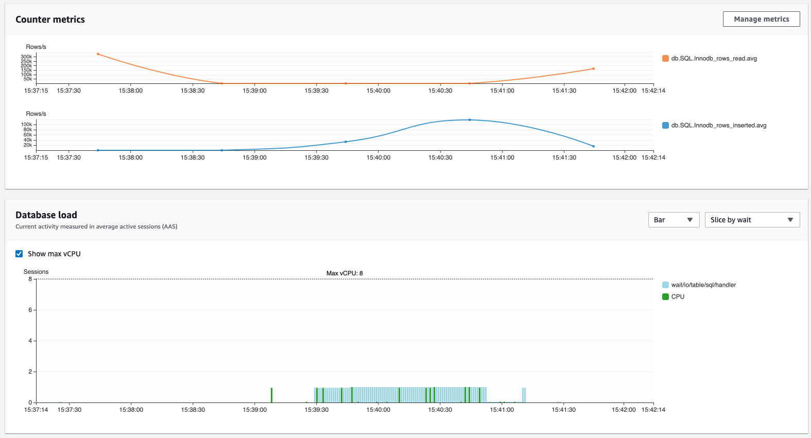 </kbd>

**Parallel degree 4 Load**

```
ubuntu@ip-172-31-31-236:~$ python3 mysql_parallel_load.py dummy_data.csv test_load 4
Splitting /home/ubuntu/dummy_data.csv into 4 chunks
Done splitting the file, took 0.15 seconds
Creating a new thread to load /tmp/dummy_data_1.csv
Creating a new thread to load /tmp/dummy_data_2.csv
Creating a new thread to load /tmp/dummy_data_3.csv
Creating a new thread to load /tmp/dummy_data_0.csv
Starting new load data thread
Starting new load data thread
Starting new load data thread
Starting new load data thread
LOAD DATA LOCAL INFILE '/tmp/dummy_data_1.csv' INTO TABLE test_load FIELDS TERMINATED BY ',' OPTIONALLY ENCLOSED BY '"' LINES TERMINATED BY '\n'
Loading /tmp/dummy_data_1.csv into table test_load
LOAD DATA LOCAL INFILE '/tmp/dummy_data_2.csv' INTO TABLE test_load FIELDS TERMINATED BY ',' OPTIONALLY ENCLOSED BY '"' LINES TERMINATED BY '\n'
Loading /tmp/dummy_data_2.csv into table test_load
LOAD DATA LOCAL INFILE '/tmp/dummy_data_3.csv' INTO TABLE test_load FIELDS TERMINATED BY ',' OPTIONALLY ENCLOSED BY '"' LINES TERMINATED BY '\n'
Loading /tmp/dummy_data_3.csv into table test_load
LOAD DATA LOCAL INFILE '/tmp/dummy_data_0.csv' INTO TABLE test_load FIELDS TERMINATED BY ',' OPTIONALLY ENCLOSED BY '"' LINES TERMINATED BY '\n'
Loading /tmp/dummy_data_0.csv into table test_load
SQL query: LOAD DATA LOCAL INFILE '/tmp/dummy_data_2.csv' INTO TABLE test_load FIELDS TERMINATED BY ',' OPTIONALLY ENCLOSED BY '"' LINES TERMINATED BY '\n'
Finished loading /tmp/dummy_data_2.csv to test_load, inserted a total of 2500053 rows in 40.39 seconds
SQL query: LOAD DATA LOCAL INFILE '/tmp/dummy_data_3.csv' INTO TABLE test_load FIELDS TERMINATED BY ',' OPTIONALLY ENCLOSED BY '"' LINES TERMINATED BY '\n'
Finished loading /tmp/dummy_data_3.csv to test_load, inserted a total of 2500121 rows in 40.41 seconds
SQL query: LOAD DATA LOCAL INFILE '/tmp/dummy_data_1.csv' INTO TABLE test_load FIELDS TERMINATED BY ',' OPTIONALLY ENCLOSED BY '"' LINES TERMINATED BY '\n'
Finished loading /tmp/dummy_data_1.csv to test_load, inserted a total of 2499754 rows in 40.62 seconds
SQL query: LOAD DATA LOCAL INFILE '/tmp/dummy_data_0.csv' INTO TABLE test_load FIELDS TERMINATED BY ',' OPTIONALLY ENCLOSED BY '"' LINES TERMINATED BY '\n'
Finished loading /tmp/dummy_data_0.csv to test_load, inserted a total of 2500071 rows in 40.93 seconds
Finished parallel loading of 9999999 rows in 41.19 seconds

ubuntu@ip-172-31-31-236:~$  python3 mysql_parallel_load.py dummy_data.csv test_load 4
Splitting /home/ubuntu/dummy_data.csv into 4 chunks
Done splitting the file, took 0.15 seconds
Creating a new thread to load /tmp/dummy_data_3.csv
Creating a new thread to load /tmp/dummy_data_2.csv
Creating a new thread to load /tmp/dummy_data_0.csv
Creating a new thread to load /tmp/dummy_data_1.csv
Starting new load data thread
Starting new load data thread
Starting new load data thread
Starting new load data thread
Finished loading /tmp/dummy_data_3.csv to test_load, inserted a total of 2500121 rows in 40.2 seconds
Finished parallel loading of 9999999 rows in 40.48 seconds
```

<kbd> 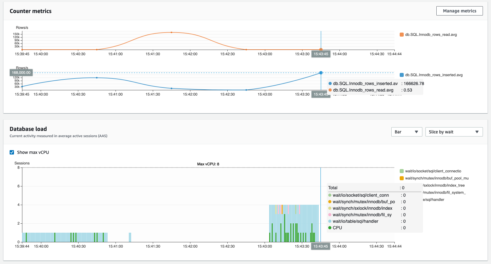 </kbd>

**Parallel degree 8 Load**

```
ubuntu@ip-172-31-31-236:~$ python3 mysql_parallel_load.py dummy_data.csv test_load 8
Splitting /home/ubuntu/dummy_data.csv into 8 chunks
Done splitting the file, took 0.11 seconds
Creating a new thread to load /tmp/dummy_data_4.csv
Creating a new thread to load /tmp/dummy_data_5.csv
Creating a new thread to load /tmp/dummy_data_6.csv
Creating a new thread to load /tmp/dummy_data_7.csv
Creating a new thread to load /tmp/dummy_data_2.csv
Creating a new thread to load /tmp/dummy_data_0.csv
Creating a new thread to load /tmp/dummy_data_3.csv
Creating a new thread to load /tmp/dummy_data_1.csv
Starting new load data thread
Starting new load data thread
Starting new load data thread
Starting new load data thread
Starting new load data thread
Starting new load data thread
Starting new load data thread
Starting new load data thread
Finished loading /tmp/dummy_data_1.csv to test_load, inserted a total of 1250126 rows in 38.34 seconds
Finished parallel loading of 9999999 rows in 38.53 seconds

ubuntu@ip-172-31-31-236:~$ python3 mysql_parallel_load.py dummy_data.csv test_load 8
Splitting /home/ubuntu/dummy_data.csv into 8 chunks
Done splitting the file, took 0.12 seconds
Creating a new thread to load /tmp/dummy_data_4.csv
Creating a new thread to load /tmp/dummy_data_5.csv
Creating a new thread to load /tmp/dummy_data_3.csv
Creating a new thread to load /tmp/dummy_data_0.csv
Creating a new thread to load /tmp/dummy_data_2.csv
Creating a new thread to load /tmp/dummy_data_7.csv
Creating a new thread to load /tmp/dummy_data_1.csv
Creating a new thread to load /tmp/dummy_data_6.csv
Starting new load data thread
Starting new load data thread
Starting new load data thread
Starting new load data thread
Starting new load data thread
Starting new load data thread
Starting new load data thread
Starting new load data thread
Finished parallel loading of 9999999 rows in 39.44 seconds
```

<kbd>  </kbd>

**load from s3**

```
mysql> load data from s3 's3://bike-test-kiwony/dummy_data.csv' into table test_load fields terminated by ','  lines terminated by '\n' ;
Query OK, 9999999 rows affected, 65535 warnings (1 min 17.81 sec)
Records: 9999999  Deleted: 0  Skipped: 0  Warnings: 19999998

mysql> load data from s3 's3://bike-test-kiwony/dummy_data.csv' into table test_load fields terminated by ','  lines terminated by '\n' ;
Query OK, 9999999 rows affected, 65535 warnings (1 min 19.64 sec)
Records: 9999999  Deleted: 0  Skipped: 0  Warnings: 19999998
```

<kbd> 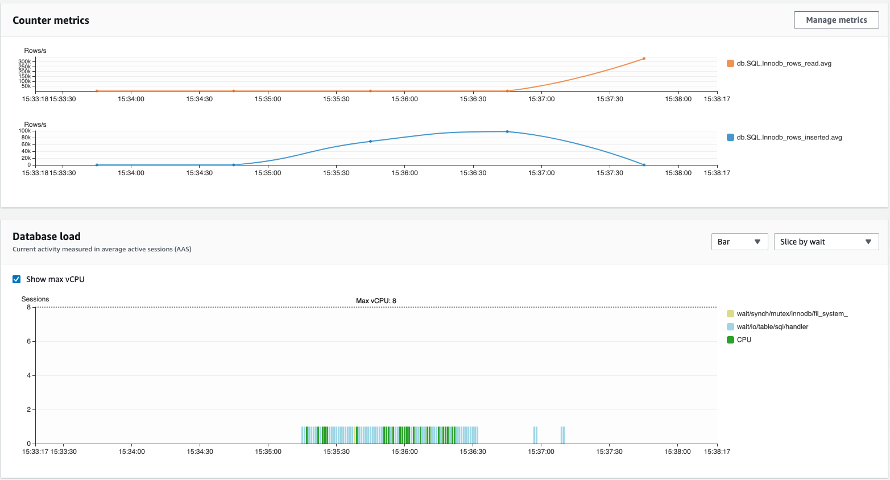 </kbd>

**load from s3 parallel4**

```
ubuntu@ip-172-31-31-236:~$ split -l 2500000 dummy_data.csv dummy_data_
ubuntu@ip-172-31-31-236:~$ aws s3 cp . s3://bike-test-kiwony --recursive --exclude "*" --include "dummy_data_*"

mysql> load data from s3 's3://bike-test-kiwony/dummy_data_aa' into table test_load fields terminated by ','  lines terminated by '\n' ;
Query OK, 2500000 rows affected, 65535 warnings (41.17 sec)
Records: 2500000  Deleted: 0  Skipped: 0  Warnings: 5000000

mysql> load data from s3 's3://bike-test-kiwony/dummy_data_ab' into table test_load fields terminated by ','  lines terminated by '\n' ;
Query OK, 2500000 rows affected, 65535 warnings (40.60 sec)
Records: 2500000  Deleted: 0  Skipped: 0  Warnings: 5000000

mysql> load data from s3 's3://bike-test-kiwony/dummy_data_ac' into table test_load fields terminated by ','  lines terminated by '\n' ;
Query OK, 2500000 rows affected, 65535 warnings (40.43 sec)
Records: 2500000  Deleted: 0  Skipped: 0  Warnings: 5000000

mysql> load data from s3 's3://bike-test-kiwony/dummy_data_ad' into table test_load fields terminated by ','  lines terminated by '\n' ;
Query OK, 2499999 rows affected, 65535 warnings (41.01 sec)
Records: 2499999  Deleted: 0  Skipped: 0  Warnings: 4999998


mysql> load data from s3 's3://bike-test-kiwony/dummy_data_aa' into table test_load fields terminated by ','  lines terminated by '\n' ;
Query OK, 2500000 rows affected, 65535 warnings (38.90 sec)
Records: 2500000  Deleted: 0  Skipped: 0  Warnings: 5000000

mysql> load data from s3 's3://bike-test-kiwony/dummy_data_ab' into table test_load fields terminated by ','  lines terminated by '\n' ;
Query OK, 2500000 rows affected, 65535 warnings (39.29 sec)
Records: 2500000  Deleted: 0  Skipped: 0  Warnings: 5000000

mysql> load data from s3 's3://bike-test-kiwony/dummy_data_ac' into table test_load fields terminated by ','  lines terminated by '\n' ;
Query OK, 2500000 rows affected, 65535 warnings (39.54 sec)
Records: 2500000  Deleted: 0  Skipped: 0  Warnings: 5000000

mysql> load data from s3 's3://bike-test-kiwony/dummy_data_ad' into table test_load fields terminated by ','  lines terminated by '\n' ;
Query OK, 2499999 rows affected, 65535 warnings (38.85 sec)
Records: 2499999  Deleted: 0  Skipped: 0  Warnings: 4999998

```

<kbd> 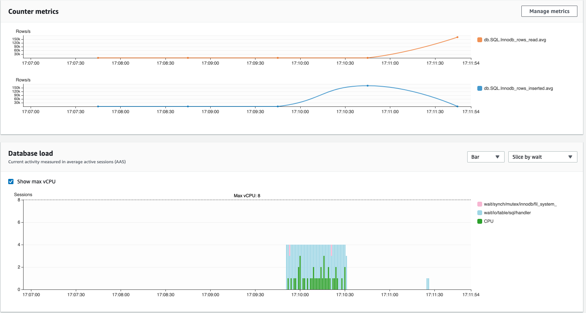 </kbd>

<kbd> 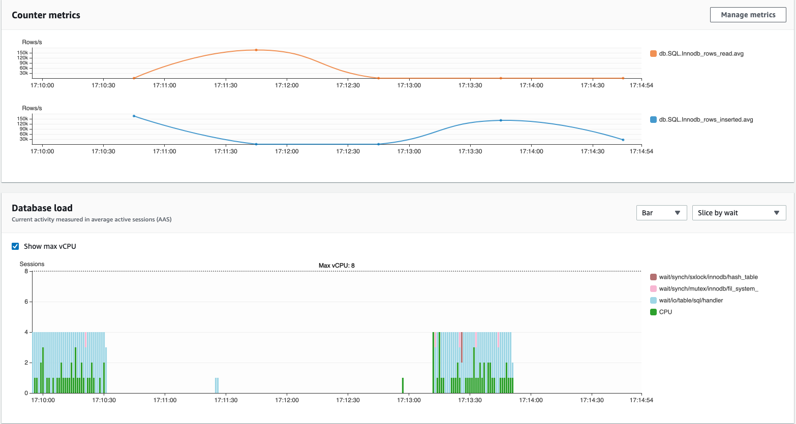 </kbd>

**load from s3 degree 8**

```
mysql> load data from s3 's3://bike-test-kiwony/dummy_data_8_aa' into table test_load fields terminated by ','  lines terminated by '\n' ;
Query OK, 1250000 rows affected, 65535 warnings (35.96 sec)
Records: 1250000  Deleted: 0  Skipped: 0  Warnings: 2500000
...
mysql> load data from s3 's3://bike-test-kiwony/dummy_data_8_ah' into table test_load fields terminated by ','  lines terminated by '\n' ;
Query OK, 1249999 rows affected, 65535 warnings (35.06 sec)
Records: 1249999  Deleted: 0  Skipped: 0  Warnings: 2499998


---

mysql> load data from s3 's3://bike-test-kiwony/dummy_data_8_aa' into table test_load fields terminated by ','  lines terminated by '\n' ;
Query OK, 1250000 rows affected, 65535 warnings (36.45 sec)
Records: 1250000  Deleted: 0  Skipped: 0  Warnings: 2500000

mysql> load data from s3 's3://bike-test-kiwony/dummy_data_8_ah' into table test_load fields terminated by ','  lines terminated by '\n' ;
Query OK, 1249999 rows affected, 65535 warnings (35.21 sec)
Records: 1249999  Deleted: 0  Skipped: 0  Warnings: 2499998


```

<kbd> 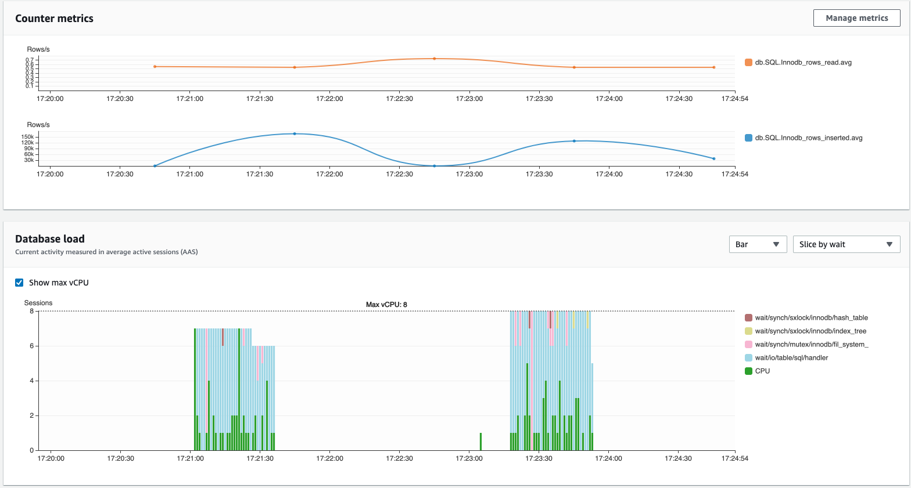 </kbd>

**CPU Usage of Aurora**

<kbd> 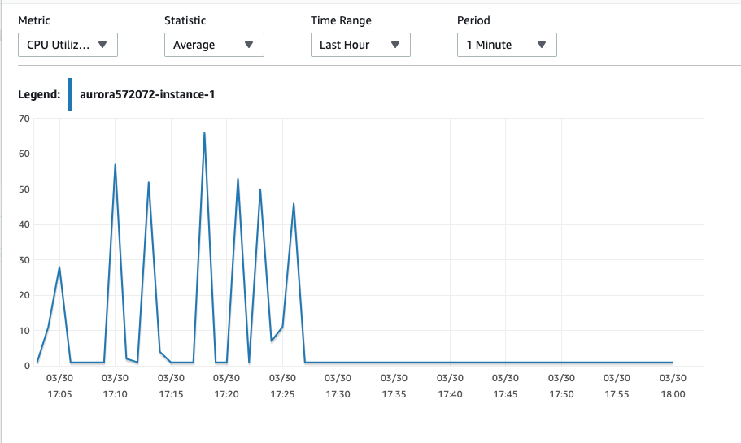 </kbd>

<kbd> 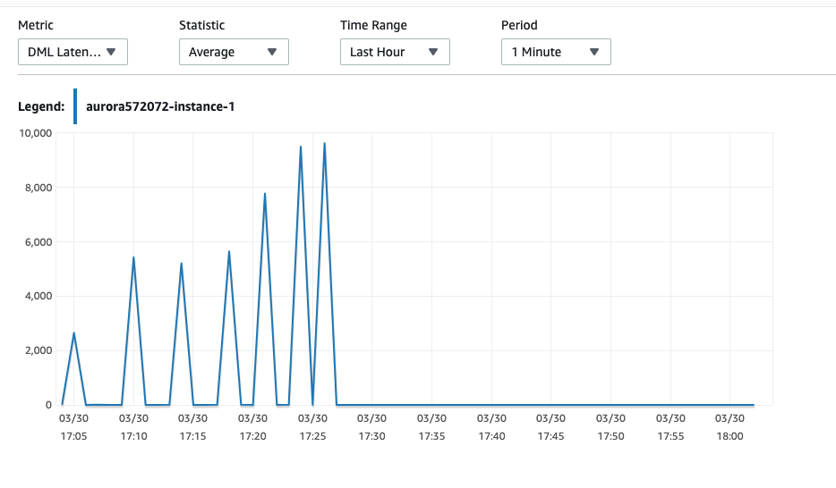 </kbd>

<kbd> 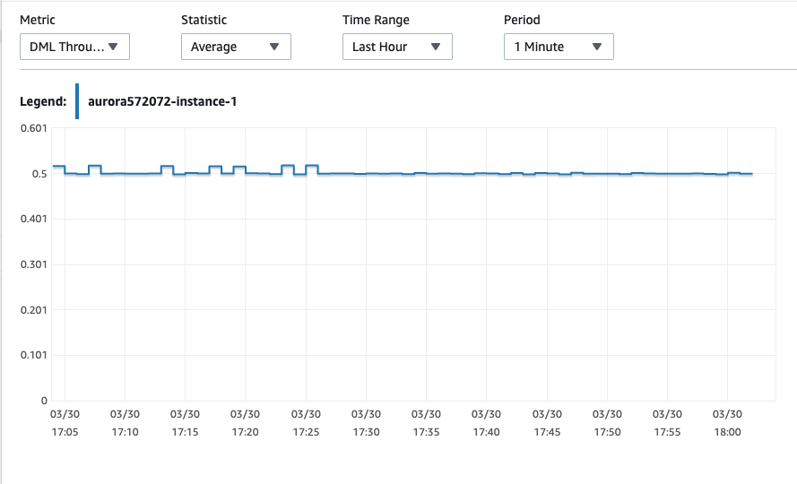 </kbd>

<kbd> 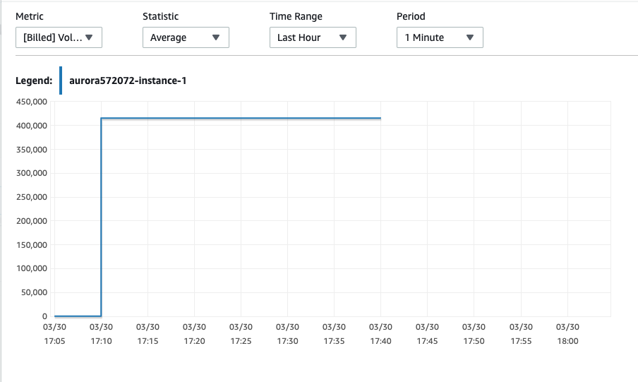 </kbd>

<kbd> 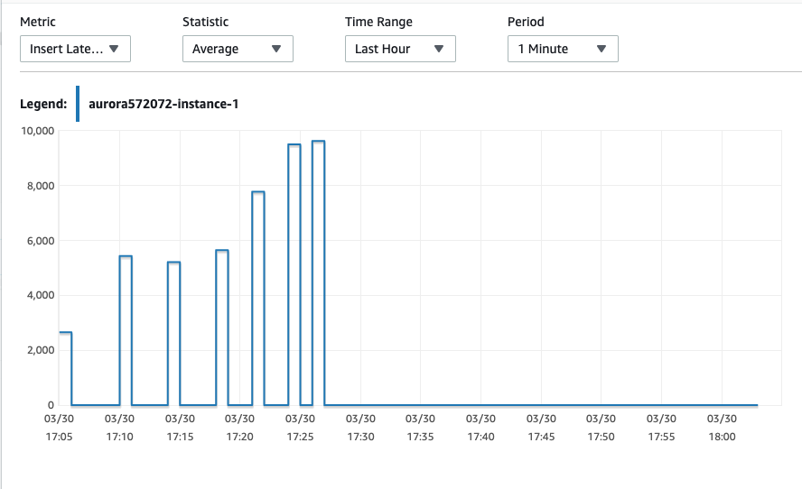 </kbd>
